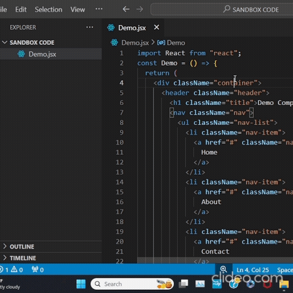

# CSSGenie

**CSSGenie** is a Visual Studio Code extension designed to simplify the process of creating CSS files for your JSX code. By automatically extracting class names and generating a corresponding CSS file, CSSGenie helps streamline your workflow and saves you time that would otherwise be spent manually copying class names and setting up CSS rules.

## Visual Guide

For a visual demonstration of how to use CSSGenie, refer to the following animated GIF:



## Usage

1. **Open a JSX File:**
   - Launch Visual Studio Code and open the JSX file from which you want to extract class names.

2. **Activate the Extension:**
   - Open the Command Palette by pressing `Ctrl+Shift+P` (`Cmd+Shift+P` on macOS).
   - Type `CSSGenie: Extract Class Names` and select the command from the list.

3. **Generate CSS File:**
   - CSSGenie will automatically generate a CSS file in the same directory as your JSX file. The file will be named `<original-file-name>.css`.
   - The generated CSS file will contain empty CSS rules for each class name found in your JSX code, ready for you to add your styles.

4. **View the Generated CSS:**
   - Open the newly created CSS file to see the skeleton CSS rules. You can now proceed to style your classes as needed.

## Features

- **Automated Class Name Extraction:** Extracts class names from JSX code with a single command, reducing manual effort.
- **CSS File Generation:** Creates a CSS file with placeholders for each class name found, so you can easily add your styles.
- **Time-Saving:** Eliminates the need for manual copying and pasting of class names, speeding up the development process.
- **Easy Command Access:** Available directly from the VS Code Command Palette for quick and convenient use.

## Installation

You can install **CSSGenie** directly from the Visual Studio Code Marketplace:

1. **Open Visual Studio Code.**
2. **Go to the Extensions view** by clicking on the Extensions icon in the Activity Bar on the side of the window or pressing `Ctrl+Shift+X` (`Cmd+Shift+X` on macOS).
3. **Search for "CSSGenie".**
4. **Click the Install button** to add the extension to your VS Code environment.

## Example

Suppose you have a JSX file `App.jsx` with the following content:

```jsx
<div className="container">
  <h1 className="title">Hello World</h1>
  <p className="description">Welcome to CSSGenie!</p>
</div>
```
After running the CSSGenie: Extract Class Names command, CSSGenie will create a file App.css with the following content:

```css
.container {

}

.title {

}

.description {

}
```